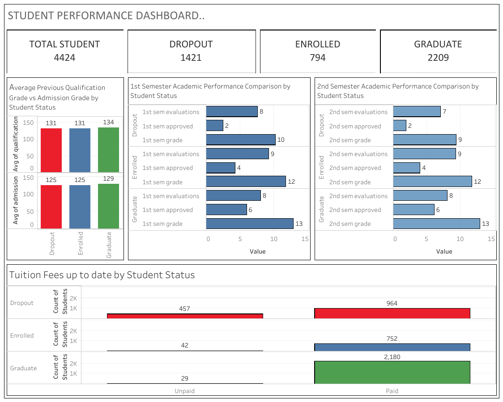

# **Proyek Akhir: Menyelesaikan Permasalahan Perusahaan Edutech**
## **Business Understanding**
Jaya Jaya Institut merupakan salah satu institusi pendidikan perguruan yang telah berdiri sejak tahun 2000. Hingga saat ini ia telah mencetak banyak lulusan dengan reputasi yang sangat baik. Akan tetapi, terdapat banyak juga siswa yang tidak menyelesaikan pendidikannya alias dropout. Jumlah dropout yang tinggi ini tentunya menjadi salah satu masalah yang besar untuk sebuah institusi pendidikan.  
Guna mengatasi permasalahan ini, perlu dilakukan analisis mendalam untuk mengidentifikasi faktor-faktor pemicu dropout serta pengembangan business dashboard sebagai alat monitoring. Solusi ini bertujuan mempermudah institusi dalam memantau performa mahasiswa sekaligus mempercepat pengambilan langkah intervensi yang tepat sasaran.

## **Permasalahan Bisnis**
Permasalahan utama yang sedang dihadapi Jaya Jaya Institut meliputi : 
1. Belum teridentifikasinya faktor-faktor determinan yang menjadi pemicu utama tingginya angka dropout siswa.
2. Belum tersedianya business dashboard untuk memantau performa siswa secara efektif.

## **Cakupan Proyek**
Proyek ini berfokus pada pengolahan data historis seluruh siswa yang bersumber dari Jaya Jaya Institut. Lingkup pekerjaan utama meliputi transformasi data menjadi business dashboard untuk mengidentifikasi berbagai faktor pemicu dropout, serta menerapkan sistem berbasis machine learning untuk memprediksi probabilitas dropout.  
Berdasarkan cakupan proyek tersebut, dibutuhkan beberapa resource dan tool seperti berikut :
1. Bahasa pemrograman Python sebagai tool utama dalam proyek ini.
2. Berbagai library pendukung untuk pengolahan data dan pengembangan model machine learning.
3. Tableau Public sebagai tool yang digunakan untuk membuat business dashboard.
4. Streamlit sebagai tool yang digunakan untuk membuat sebuah prototype sederhana berbasis machine learning.

## **Persiapan**
| 
Deskripsi
 | 
Command
 |
| :--- | :--- |
| Sumber Data | [Click here to Dataset](https://raw.githubusercontent.com/dicodingacademy/dicoding_dataset/refs/heads/main/students_performance/data.csv) | 
| Setup Environment - Anaconda | conda create --name students-performance python=3.13 conda activate students-performance pip install numpy pandas scipy matplotlib seaborn jupyter scikit-learn imbalanced-learn streamlit babel pip freeze > requirements.txt pip install -r requirements.txt |

## **Business Dashboard**
Student Performance Dashboard ini dirancang dalam bentuk visualisasi chart/grafik untuk membantu Jaya Jaya Institut dalam mengidentifikasi faktor-faktor yang mempengaruhi atau memicu terjadinya dropout.

Adapun bentuk visualisasi yang telah dibuat pada dashboard ini meliputi :
| 
Indikator
 | 
Deskripsi
 |
| :--- | :--- |
| Total Student | Menampilkan jumlah keseluruhan siswa dalam institut. |
| Dropout | Menampilkan jumlah siswa yang telah dinyatakan putus studi (dropout). |
| Enrolled | Menampilkan jumlah siswa aktif yang saat ini tengah menempuh pendidikan. |
| Graduate | Menampilkan jumlah siswa yang telah berhasil menyelesaikan masa studi (lulus). |
| Average Previous Qualification Grade vs Admission Grade by Student Status | Visualisasi perbandingan antara rata-rata previous qualification grade dengan admission grade berdasarkan status akademik siswa (Dropout, Enrolled, dan Graduate). |
| 1st Semester Academic Performance Comparison by Student Status | Visualisasi perbandingan antara rata-rata jumlah mata kuliah yang diuji (*evaluations*), yang lulus (*approved*), dan nilai rata-rata (*grade*) pada semester pertama berdasarkan status akademik siswa (Dropout, Enrolled, dan Graduate). |
| 2nd Semester Academic Performance Comparison by Student Status | Visualisasi perbandingan antara rata-rata jumlah mata kuliah yang diuji (*evaluations*), yang lulus (*approved*), dan nilai rata-rata (*grade*) pada semester kedua berdasarkan status akademik siswa (Dropout, Enrolled, dan Graduate). |
| Tuition Fees up to date by Student Status | Menampilkan status pembayaran uang kuliah mahasiswa (apakah paid atau unpaid) berdasarkan status akademik siswa (Dropout, Enrolled, dan Graduate). |  

Diharapkan dengan adanya visualisasi data ini, institusi dapat mengambil langkah strategis untuk menekan angka dropout dan meningkatkan tingkat kelulusan siswa.  
Dashboard interaktif dapat diakses pada tautan di bawah ini : [Click here to view dashboard](https://public.tableau.com/views/student_performance_17701627938620/Dashboard1?:language=en-US&:sid=&:redirect=auth&:display_count=n&:origin=viz_share_link)

